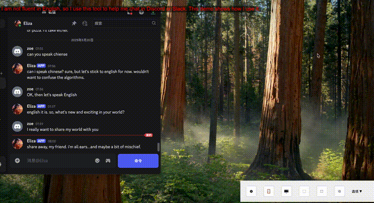

# 🧩 实时屏幕翻译工具｜支持 Discord / Slack / Telegram 多平台跨语言聊天

一个轻量级桌面工具，帮助你在 **Discord、Slack、Telegram** 等聊天软件中，**实时翻译屏幕上的任何文字**，无需复制粘贴，直接选中区域就能看到翻译结果，让跨语言交流变得更轻松。

---

## 🔧 功能简介

- 🖱 **框选屏幕任意区域**（支持 PDF、图片、视频、聊天窗口等）
- 🔍 **自动文字识别（OCR）**
- 🌐 **实时翻译成中文或其他语言**
- 💬 **支持输入翻译**：你也可以输入自己的语言，实时翻译为对方的语言，用于发送消息
- ⚡️ 全程无需手动触发，几乎“选中即翻译”，真正做到了贴身翻译助手

---

## 🎯 使用场景

- 🧑‍🤝‍🧑 Discord / Slack 群组聊天，跟外国网友沟通无压力
- 🕹 玩日语 / 英语游戏时，翻译屏幕内容
- 📚 阅读无法复制的扫描版英文论文或图文 PDF
- 🌍 外贸聊天、语言学习者日常翻译需求

---

## 🖼 演示图（Demo）

---

## 🚧 当前进度

目前处于 **PoC / Demo 阶段**，核心功能已完成并可使用，但界面尚未美化。如果你对这个工具感兴趣，**非常欢迎你来试用并提出反馈**！

---

## 📦 如何试用

> 🧪 目前尚未正式发布安装包  
> 📩 如果你想体验测试版，可以在 GitHub 上开一个 issue，或者私信我。我会手动发送最新构建版本。

---

## 🔜 未来计划

- 🌍 自动识别原文语言
- 📜 翻译历史记录 + 一键复制
- 🧠 接入大模型，提升翻译质量
- ⌨️ 快捷键选区、翻译结果可导出等功能

---

## 🙌 期待反馈

这是一个独立开发者的个人项目。如果你也是：

- 🌍 Discord / Slack 等跨国平台的用户
- 🧠 外语学习者
- 📈 喜欢新工具的探索者

欢迎留言、提 issue 或私信我，如果你觉得这个工具有用，也请点个 ⭐Star 鼓励一下！

---

## 🏷 标签

`#实时翻译` `#OCR识别` `#多语言聊天` `#跨语言交流` `#翻译小工具` `#桌面应用` `#独立开发`

> 👇 想本地部署使用？查看 👉 [完整安装文档](docs/installation.md)

